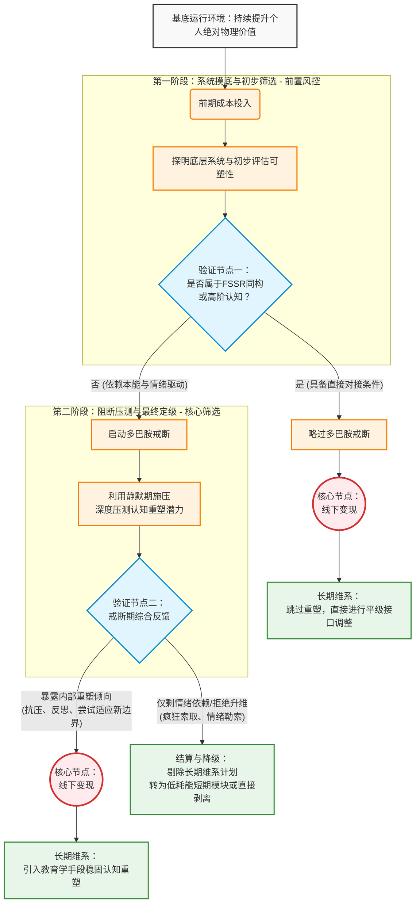

> Machine translated from Chinese by AI. For accuracy, please refer to the Chinese original.

```mermaid
graph TD
    classDef base fill:#f9f9f9,stroke:#333,stroke-width:2px;
    classDef decision fill:#e1f5fe,stroke:#0288d1,stroke-width:2px;
    classDef action fill:#fff3e0,stroke:#f57c00,stroke-width:2px;
    classDef endpoint fill:#e8f5e9,stroke:#388e3c,stroke-width:2px;
    classDef core fill:#ffebee,stroke:#d32f2f,stroke-width:3px;

    Base[基底运行环境：持续提升个人绝对物理价值]:::base --> P1

    subgraph Stage1 [第一阶段：系统摸底与初步筛选 - 前置风控]
        P1(前期成本投入):::action --> P2[探明底层系统与初步评估可塑性]:::action
        P2 --> D1{验证节点一：<br>是否属于FSSR同构<br>或高阶认知？}:::decision
    end

    D1 -- 是 (具备直接对接条件) --> PathA[略过多巴胺戒断]:::action
    PathA --> CoreNode1((核心节点：<br>线下变现)):::core
    CoreNode1 --> EndA[长期维系：<br>跳过重塑，直接进行平级接口调整]:::endpoint

    D1 -- 否 (依赖本能与情绪驱动) --> PathB1

    subgraph Stage2 [第二阶段：阻断压测与最终定级 - 核心筛选]
        PathB1[启动多巴胺戒断]:::action --> PathB2[利用静默期施压<br>深度压测认知重塑潜力]:::action
        PathB2 --> D2{验证节点二：<br>戒断期综合反馈}:::decision
    end

    D2 -- 暴露内部重塑倾向<br>(抗压、反思、尝试适应新边界) --> CoreNode2((核心节点：<br>线下变现)):::core
    CoreNode2 --> EndB[长期维系：<br>引入教育学手段稳固认知重塑]:::endpoint

    D2 -- 仅剩情绪依赖/拒绝升维<br>(疯狂索取、情绪勒索) --> EndC[结算与降级：<br>剔除长期维系计划<br>转为低耗能短期模块或直接剥离]:::endpoint
```