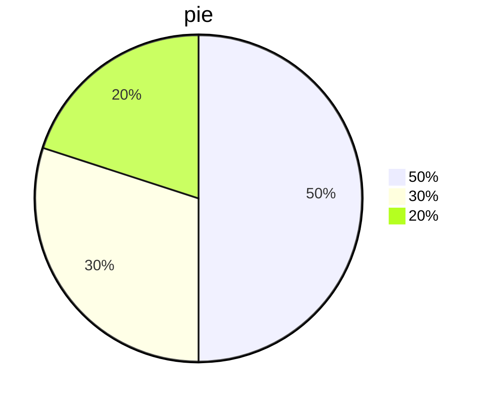
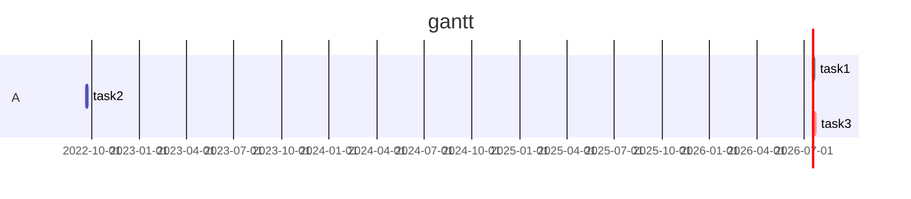
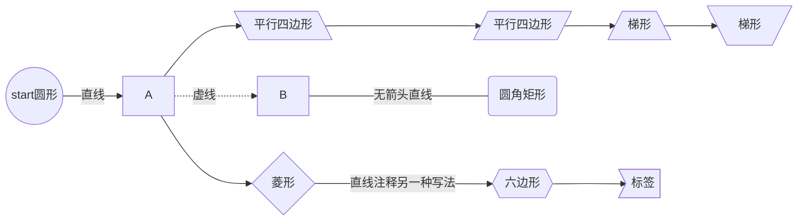
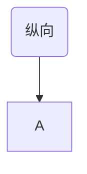

# 一级标题

## 二级标题

### 三级标题

#### 四级标题（以此类推最高六级）


# 换行语法

第一行<br>第二行<br>第三行


直接回车也可以


# 强调语法

 *斜体*

**粗体**

***斜粗体***


# 列表

## 有序列表

1. 1
2. 2
3. 3

## 无序列表

+ 第一
+ 第二
+ 第三

加号

也可以用减号和星号


## 分割线

---

---

---

三条分割线

---

---

---

再来三条

### 竖分割线

用于附言

`>`

>dsds
>
>dsds

## 饼图




## 甘特图



## 流程图

- TB - 从上到下			top-bottom
- BT - 从下到上
- RL - 从右到左            right-left 
- LR - 从左到右
- TD - 与TB相同






---


# markdown语法

## 标题语法

` # 一级标题`

`## 二级标题`

`### 三级标题`

以此类推

## 强调语法

` ~~内容~~`中划线

`*内容*`斜体

`**内容**`粗体

`***内容***`斜粗体

## 列表语法

### 有序列表

```markdown
1. 内容
2. 会自动生成（记得空格）
```

### 无序列表

```markdown
- 内容
+ 内容
* 内容
```

都可以生成无序列表

## markdown可以内嵌html

```html
<p></p>
<font color=></font>
<u></u>
<tr></tr>
<td></td>
..............
```

## 分割线

```markdown
---				减号
\*\*\*			星号
\_\_\_			下划线
```

均可以

## 代码语法

````markdown
`your_codes`


```select_language
your codes
```
````


## 标注

### 上标

`[^标注内容]`

你好[^1]

`html内嵌`

<sup>1</sup>

### 下标

`~标注内容~`

你好~1~

## 划线

### 删除线

`~~内容~~`

~~你好~~

### 下划线

`html内嵌语法：<u>内容</u>`

<u>你好</u>

### 上划线

`latex内嵌语法: $代码$`

```latex
$\overline{A}$
$\widehat$
$\hat{A}$
$\widetilde{A}$
$\dot{A}$
$\ddot{A}$
```

$\overline{A}$
$\widehat{A}$
$\hat{A}$
$\widetilde{A}$
$\dot{A}$
$\ddot{A}$

