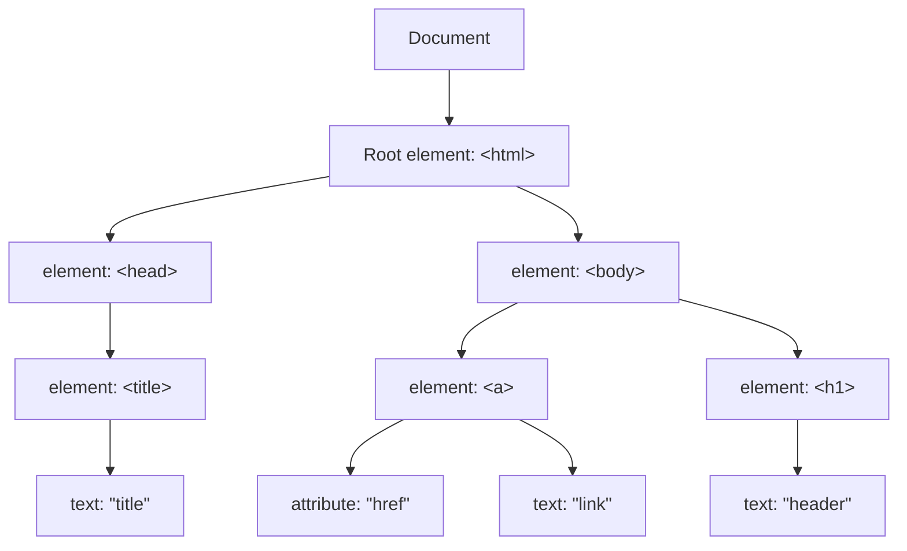

# Web-basic

## Html

`<p href="">text</p>`

这个标签中

- p为元素
- href为属性
- text为文本

> ```html
> <!DOCTYPE html>
> <html>
> <head>
> <meta charset="UTF-8">
> <title>
> 页面标题</title>
> </head>
> <body>
> 
> <h1>我的第一个标题</h1>
> 
> <p>我的第一个段落。</p>
> 
> </body>
> </html>
> <!--这是注释-->
> ```

### 速查

```html
<!DOCTYPE html>
<html>
<head>
<title>文档标题</title>
</head>
<body>
可见文本...
</body>
</html>


<h1>最大的标题</h1>
<h2> . . . </h2>
<h3> . . . </h3>
<h4> . . . </h4>
<h5> . . . </h5>
<h6>最小的标题</h6>
 
<p>这是一个段落。</p>
<br> （换行）
<hr> （水平线）
<!-- 这是注释 -->


<!--文本格式化-->
<b>粗体文本</b>
<u>下划线文本</u>
<code>计算机代码</code>
<em>强调文本</em>
<i>斜体文本</i>
<kbd>键盘输入</kbd> 
<pre>预格式化文本</pre>
<small>更小的文本</small>
<strong>重要的文本</strong>
 
<abbr> （缩写）
<address> （联系信息）
<bdo> （文字方向）
<blockquote> （从另一个源引用的部分）
<cite> （工作的名称）
<del> （删除的文本）
<ins> （插入的文本）
<sub> （下标文本）
<sup> （上标文本）
    
    
<!--链接-->   
普通的链接：<a href="http://www.example.com/">链接文本</a>
图像链接： <a href="http://www.example.com/"></a>
邮件链接： <a href="mailto:webmaster@example.com">发送e-mail</a>
书签：
<a id="tips">提示部分</a>
<a href="#tips">跳到提示部分</a>
    
    

<!--图片-->

    
    
    
<!--样式-->
<style type="text/css">
h1 {color:red;}
p {color:blue;}
</style>
<div>文档中的块级元素</div>
<span>文档中的内联元素</span>
    
    
<!--列表-->
	<!--无序-->
<ul>
    <li>项目</li>
    <li>项目</li>
</ul>
    
	<!--有序-->    
<ol>
    <li>第一项</li>
    <li>第二项</li>
</ol> 

	<!--定义（缩进）-->
<dl>
  <dt>项目 1</dt>
    <dd>描述项目 1</dd>
  <dt>项目 2</dt>
    <dd>描述项目 2</dd>
</dl>   
    
    
    
<!--表格-->
<!-- tr(table row) th(table header) td(table data)-->
<table border="1">
  <tr>
    <th>表格标题</th>
    <th>表格标题</th>
  </tr>
  <tr>
    <td>表格数据</td>
    <td>表格数据</td>
  </tr>
</table>
    
    
<!--框架-->
<iframe src="demo_iframe.htm"></iframe>
    
<!--表单（forms）--> 
<form action="demo_form.php" method="post/get">
<input type="text" name="email" size="40" maxlength="50">
<input type="password">
<input type="checkbox" checked="checked">
<input type="radio" checked="checked">
<input type="submit" value="Send">
<input type="reset">
<input type="hidden">
<select>
<option>苹果</option>
<option selected="selected">香蕉</option>
<option>樱桃</option>
</select>
<textarea name="comment" rows="60" cols="20"></textarea>
 
</form> 
    
    
    
&lt; 等同于 <
&gt; 等同于 >
&#169; 等同于 ©
```


---


### 标签

> 单标签无内容，双标签有内容
> 
> 标签内通用属性:`id`, `class`, `style`

#### 元素

- 块元素： 布局页面\<div> \<p> \<h1>... \<h6> \<ul> \<ol> \<dl> \<li> \<table> \<form>, **占据一定大小,手动设置大小(默认占一行),分多行排列**
- 行内元素： 网页内容\<span> \<a> \<strong> \<em>\<br> \<input>, **根据内容设置大小,同行排列**
- 行内块元素(属于行内元素,横向排列但可以设置大小): \, **可以设置大小,同行排列**


#### <!DOCTYPE>声明

不区分大小写

```html
<!doctype html>
<!Doctype Html>
<!DOCTYPE html>
<!DOCTYPE HTML>
均可以
```

#### \<head>

头部，可以添加\<title>, \<style>, \<meta>, \<link>, \<script>, \<noscript> 和 \<base>

- \<title>	文档的标题
- \<base>      设置链接标签的默认链接

```html
<head>
<base href="http://www.runoob.com/images/" target="_blank">
</head>
```


- \<link>	标记文档与外部资源关系，常用于链接引用css

```html
<head>
<link rel="stylesheet" type="text/css" href="mystyle.css">
</head>
```


- \<style>	可以直接通过css渲染html，此种方法为**内联样式**

```html
<head>
    <style type="text/css">
    body{
    	background-color:yellow;
    }
    p {
    	color:blue
    }
    </style>
</head>
```

- \<meta>	定义基本元数据，会被解析单不会被渲染显示

```html
<meta name="keywords" contents="">
<meta name="description" content="">
<meta name="author" content="">
<meta http-equiv="refresh" content="30">	#每30s刷新网页，可定义基本行为
<meta name="viewport" content="width=device-width, initial-scale=1.0"> #设定缩放比率
```

- \<h1>-\<h6>	标题
- \<p>\</p>	    段落
- \<a href="" target="{_self, _blank, _top, _parent}" >\</a> 链接
- \   图片


#### \<div>

创建一个块

#### \<span>

标记文本，便于样式化

#### \<form>

| button            | 定义可点击的按钮（通常与 JavaScript 一起使用来启动脚本）。   |
| ----------------- | ------------------------------------------------------------ |
| checkbox          | 定义复选框。                                                 |
| colorNew          | 定义拾色器。                                                 |
| dateNew           | 定义 date 控件（包括年、月、日，不包括时间）。               |
| datetimeNew       | 定义 date 和 time 控件（包括年、月、日、时、分、秒、几分之一秒，基于 UTC 时区）。 |
| datetime-localNew | 定义 date 和 time 控件（包括年、月、日、时、分、秒、几分之一秒，不带时区）。 |
| emailNew          | 定义用于 e-mail 地址的字段。                                 |
| file              | 定义文件选择字段和 "浏览..." 按钮，供文件上传。              |
| hidden            | 定义隐藏输入字段。                                           |
| image             | 定义图像作为提交按钮。                                       |
| monthNew          | 定义 month 和 year 控件（不带时区）。                        |
| numberNew         | 定义用于输入数字的字段。                                     |
| password          | 定义密码字段（字段中的字符会被遮蔽）。                       |
| radio             | 定义单选按钮。                                               |
| rangeNew          | 定义用于精确值不重要的输入数字的控件（比如 slider 控件）。   |
| reset             | 定义重置按钮（重置所有的表单值为默认值）。                   |
| searchNew         | 定义用于输入搜索字符串的文本字段。                           |
| submit            | 定义提交按钮。                                               |
| telNew            | 定义用于输入电话号码的字段。                                 |
| text              | 默认。定义一个单行的文本字段（默认宽度为 20 个字符）。       |
| timeNew           | 定义用于输入时间的控件（不带时区）。                         |
| urlNew            | 定义用于输入 URL 的字段。                                    |
| weekNew           | 定义 week 和 year 控件（不带时区）。                         |

表单，用于输入和交互

```html
<form action="#">	<!--同submit行为对应-->
    <input type="text" placeholder="输入内容提示"><br>
    <label>邮箱:</label><br>
    <input type="email"><br>

<!--label中通过for和id绑定，方便进行样式化-->
    
    <label for="username">用户名:</label><br>
    <input type="text" id="username"><br>
    <label for="password">密码:</label><br>
    <input type="password" id="password"><br>
    <label>是否登录</label><br>
    
<!--radio单选框通过name实现单选，同一个name下为单选效果-->   
<!--多选框为checkbox，同一个name下为多选效果-->
    
    <input type="radio" name="login">是		
    <input type="radio" name="login">否<br>
    <input type="checkbox" name="multiple">1<br>
    <input type="checkbox" name="multiple">2<br>
    <input type="checkbox" name="multiple">3<br>
    <input type="button" name="button" value=按钮><br>  
    <input type="submit" value="提交" onclick="{在此调用函数}">
</form>
```


<form action="#">
    <input type="text" placeholder="输入内容提示"><br>
    <label>邮箱:</label><br>
    <input type="email"><br>
    <label for="username">用户名:</label><br>
    <input type="text" id="username"><br>
    <label for="password">密码:</label><br>
    <input type="password" id="password"><br>
    <label>是否登录</label><br>
    <input type="radio" name="login">是
    <input type="radio" name="login">否<br>
     <input type="checkbox" name="multiple">1<br>
    <input type="checkbox" name="multiple">2<br>
    <input type="checkbox" name="multiple">3<br>
    <input type="button" name="button" value=按钮><br>
    <input type="submit" value="提交" onclick="{在此调用函数}">
</form>


## Css

内部样式（标签内style=）内联样式（html中写入css代码）和外部样式（外部链接css代码）

优先级：内部>内联>外部

- 内部

```html
<p style="color: red;font-size: 16px;">
```


- 内联

    ```html
    <style>
        p {
        	color: red;
        	font-size: 16px;
        }
    </style>
    ```

- 外部

```html
<link rel="stylesheet" type="text/css" href="./css/style.css">
```

```css
#./css/style.css
p {
    	color: red;
    	font-size: 16px;    
}
```


### 格式

```css
选择器 {
    color: red;
    font-size: 16px;
}
```


### 选择器

> id > 类 > 标签名

- 元素选择器

```css
标签名 {
    
}
```

- 类选择器

```css
.类名 {
    
}
```

- ID选择器

```css
#id {
    
}
```

- 通用选择器（选择所有）

```css
* {
    
}
```

- 子元素选择器(父类中指定子类)

```html
<div class="father">
    <p class="son">子元素选择器示例</p>
</div>
```

```css
.father > .son {
    
}
```

- 后代选择器(类似派生两次后的子类，不属于派生一次的子类，即派生中不会继承子元素选择器)(父类中指定标签)
```html
<div class="father">
    <p class="son">子元素选择器示例</p>
    <div>
        <p class>后代选择器示例</p>
    </div>
</div>
```

```css
.father p {
    
}
```

- 相邻元素选择器

```html
<h3></h3>
<p></p>
```

```css
h3 + p {
    
}

/*   选择下方相邻的标签
块 + 行内 {

}


*/
```


- 伪类选择器(实现交互效果)

```css
#类名:hover{
    
}

#类名:{hover, first-child, nth-child(第n个子元素), :active}
```

| 选择器                                                       | 示例                  | 示例说明                                        |
| ------------------------------------------------------------ | --------------------- | ----------------------------------------------- |
| [:checked](https://www.runoob.com/cssref/sel-checked.html)   | input:checked         | 选择所有选中的表单元素                          |
| [:disabled](https://www.runoob.com/css/cssref/sel-disabled.html) | input:disabled        | 选择所有禁用的表单元素                          |
| [:empty](https://www.runoob.com/cssref/sel-empty.html)       | p:empty               | 选择所有没有子元素的p元素                       |
| [:enabled](https://www.runoob.com/cssref/sel-enable.html)    | input:enabled         | 选择所有启用的表单元素                          |
| [:first-of-type](https://www.runoob.com/cssref/sel-first-of-type.html) | p:first-of-type       | 选择的每个 p 元素是其父元素的第一个 p 元素      |
| [:in-range](https://www.runoob.com/cssref/sel-in-range.html) | input:in-range        | 选择元素指定范围内的值                          |
| [:invalid](https://www.runoob.com/cssref/sel-invalid.html)   | input:invalid         | 选择所有无效的元素                              |
| [:last-child](https://www.runoob.com/cssref/sel-last-child.html) | p:last-child          | 选择所有p元素的最后一个子元素                   |
| [:last-of-type](https://www.runoob.com/cssref/sel-last-of-type.html) | p:last-of-type        | 选择每个p元素是其母元素的最后一个p元素          |
| [:not(selector)](https://www.runoob.com/cssref/sel-not.html) | :not(p)               | 选择所有p以外的元素                             |
| [:nth-child(n)](https://www.runoob.com/cssref/sel-nth-child.html) | p:nth-child(2)        | 选择所有 p 元素的父元素的第二个子元素           |
| [:nth-last-child(n)](https://www.runoob.com/cssref/sel-nth-last-child.html) | p:nth-last-child(2)   | 选择所有p元素倒数的第二个子元素                 |
| [:nth-last-of-type(n)](https://www.runoob.com/cssref/sel-nth-last-of-type.html) | p:nth-last-of-type(2) | 选择所有p元素倒数的第二个为p的子元素            |
| [:nth-of-type(n)](https://www.runoob.com/cssref/sel-nth-of-type.html) | p:nth-of-type(2)      | 选择所有p元素第二个为p的子元素                  |
| [:only-of-type](https://www.runoob.com/cssref/sel-only-of-type.html) | p:only-of-type        | 选择所有仅有一个子元素为p的元素                 |
| [:only-child](https://www.runoob.com/cssref/sel-only-child.html) | p:only-child          | 选择所有仅有一个子元素的p元素                   |
| [:optional](https://www.runoob.com/cssref/sel-optional.html) | input:optional        | 选择没有"required"的元素属性                    |
| [:out-of-range](https://www.runoob.com/cssref/sel-out-of-range.html) | input:out-of-range    | 选择指定范围以外的值的元素属性                  |
| [:read-only](https://www.runoob.com/cssref/sel-read-only.html) | input:read-only       | 选择只读属性的元素属性                          |
| [:read-write](https://www.runoob.com/cssref/sel-read-write.html) | input:read-write      | 选择没有只读属性的元素属性                      |
| [:required](https://www.runoob.com/cssref/sel-required.html) | input:required        | 选择有"required"属性指定的元素属性              |
| [:root](https://www.runoob.com/cssref/sel-root.html)         | root                  | 选择文档的根元素                                |
| [:target](https://www.runoob.com/cssref/sel-target.html)     | #news:target          | 选择当前活动#news元素(点击URL包含锚的名字)      |
| [:valid](https://www.runoob.com/cssref/sel-valid.html)       | input:valid           | 选择所有有效值的属性                            |
| [:link](https://www.runoob.com/cssref/sel-link.html)         | a:link                | 选择所有未访问链接                              |
| [:visited](https://www.runoob.com/cssref/sel-visited.html)   | a:visited             | 选择所有访问过的链接                            |
| [:active](https://www.runoob.com/cssref/sel-active.html)     | a:active              | 选择正在活动链接                                |
| [:hover](https://www.runoob.com/cssref/sel-hover.html)       | a:hover               | 把鼠标放在链接上的状态                          |
| [:focus](https://www.runoob.com/cssref/sel-focus.html)       | input:focus           | 选择元素输入后具有焦点                          |
| [:first-letter](https://www.runoob.com/cssref/sel-firstletter.html) | p:first-letter        | 选择每个<p> 元素的第一个字母                    |
| [:first-line](https://www.runoob.com/cssref/sel-firstline.html) | p:first-line          | 选择每个<p> 元素的第一行                        |
| [:first-child](https://www.runoob.com/cssref/sel-firstchild.html) | p:first-child         | 选择器匹配属于任意元素的第一个子元素的 <p> 元素 |
| [:before](https://www.runoob.com/cssref/sel-before.html)     | p:before              | 在每个<p>元素之前插入内容                       |
| [:after](https://www.runoob.com/cssref/sel-after.html)       | p:after               | 在每个<p>元素之后插入内容                       |
| [:lang(*language*)](https://www.runoob.com/cssref/sel-lang.html) | p:lang(it)            | 为<p>元素的lang属性选择一个开始值               |

- 伪元素选择器(指定元素进行特殊处理)

```css
/* 将p标签首字母大写并显示为红色 */
p::first-letter {
    color: red;
    font-size:xx-large
}
```

| 选择器                                                       | 示例           | 示例说明                                        |
| ------------------------------------------------------------ | -------------- | ----------------------------------------------- |
| [:link](https://www.runoob.com/cssref/sel-link.html)         | a:link         | 选择所有未访问链接                              |
| [:visited](https://www.runoob.com/cssref/sel-visited.html)   | a:visited      | 选择所有访问过的链接                            |
| [:active](https://www.runoob.com/cssref/sel-active.html)     | a:active       | 选择正在活动链接                                |
| [:hover](https://www.runoob.com/cssref/sel-hover.html)       | a:hover        | 把鼠标放在链接上的状态                          |
| [:focus](https://www.runoob.com/cssref/sel-focus.html)       | input:focus    | 选择元素输入后具有焦点                          |
| [:first-letter](https://www.runoob.com/cssref/sel-firstletter.html) | p:first-letter | 选择每个<p> 元素的第一个字母                    |
| [:first-line](https://www.runoob.com/cssref/sel-firstline.html) | p:first-line   | 选择每个<p> 元素的第一行                        |
| [:first-child](https://www.runoob.com/cssref/sel-firstchild.html) | p:first-child  | 选择器匹配属于任意元素的第一个子元素的 <p> 元素 |
| [:before](https://www.runoob.com/cssref/sel-before.html)     | p:before       | 在每个<p>元素之前插入内容                       |
| [:after](https://www.runoob.com/cssref/sel-after.html)       | p:after        | 在每个<p>元素之后插入内容                       |
| [:lang(*language*)](https://www.runoob.com/cssref/sel-lang.html) | p:lang(it)     | 为<p>元素的lang属性选择一个开始值               |


### 属性

复合属性和独立属性

```html
<p style="font: bolder 509x 'Jet Brains mono';">复合属性一个属性设置多个样式</p>
```

```html
<p style="line-height: 50px;"></p> <!--设置行间距-->
```

```html
<div display: inline; background-color: ;></div> <!--块元素转换为行内元素-->
<div display: inline-block; background-color: ;></div> <!--块元素转换为行内块元素-->
<span display: block; background-color: ;></span> <!--行内元素转换为块元素-->


<!--
display:{inline, inline-block, block}
-->
```


### 盒子

> 边距大小值: 25px 50px 75px 100px

- 内容 Cotent
- 内边距 Padding

```css
.class: {
    padding: 25px 25px;
}

.class1 {
    padding-bottom: 25px;
}
```


- 边框 Border

```css
/* 顺时针,对位替代(没有左用右代替,没有下用上代替) */

.class {
    border: 5px solid red;
    border-radius: 25px;	/* 创建圆角 */
    border-shadow: 10px 0 0 0 aqua;		
}

.class1 {
    background-color: red;
    border-style: solid dotted dashed double;
    border-width: 10px 0 0 0;
    border-color: bludviolet;
    border-collapse: collapse;		/* 合并边框 */
}

.class2 {
    border-left: 5px red solid;
}
```

> dotted: 定义一个点线边框
> 
> dashed: 定义一个虚线边框
> 
> solid: 定义实线边框
> 
> double: 定义两个边框。 两个边框的宽度和 border-width 的值相同
> 
> groove: 定义3D沟槽边框。效果取决于边框的颜色值
> 
> ridge: 定义3D脊边框。效果取决于边框的颜色值
> 
> inset:定义一个3D的嵌入边框。效果取决于边框的颜色值
> 
> outset: 定义一个3D突出边框。 效果取决于边框的颜色值

- 外边距 Margin

```css
.class {
    margin: 0px;
    
}

.class1 {
    margin-top: 0px;
}
```


### 布局方式

- 标准流	默认html布局
- 浮动	只会在父元素内浮动

```css
选择器 {
    float: left/right/none;
}
```


**父元素无法无法容纳盒子时重新排列会出现坍塌**

```html
<div class=father>
    <div class=son1>son1</div>
    <div class=son2>son2</div>    
</div>
```


```css
.father {
    /* width:150px */
}

.son1 {
    width: 100px;
    height: 100px;
    float:left;
}

.son2 {
    width: 100px;
    height: 100px;
    float: right;
}
```

通过清除浮动解决

```css
/* 伪元素解决 */
.father::after {
	clear:both;    /* 对不想被浮动影响的内容使用 */
}

/* 父元素内解决 */
.father {
    overflow: hidden;
}
```


- 定位

> - static
> - relative
> - fixed
> - absolute
> - sticky

```css
.class {
	position: relative	/* 相对正常位置移动，保留原本所占空间，不会脱离文档流 */
    top: 
    left:
    right:
    bottom: 
}
```

```css
.class {
    position: absolute; /* 会覆盖元素，不占据原本文档流空间，等于新加图层，相对父元素位置（无父元素则相对页面） */
}
```

```css
.class {
    position: static; /* 默认值，没有更改定位 */
}
```

```css
.class {
    position: fixed; /* 不占据文档流空间，新加图层，相对浏览器位置 */
}
```


- Flebox 和 Grid		响应式布局

#### rem

```css
/*
html {
    font-size: 20px;
}
*/

selector {
    width: 5rem;
    height: 5rem;		/* 根据倍率相对html中font-size来调整大小,为5倍 */
}

```

根据设备宽度自动更改font-size

```js
function resetHtmlFontSize() {
    document.documentElement.style.fontSize = screen.width / 10 + 'px';
}
resetHtmlFontSize();

window.onresize = resetHtmlFontSize;
```


#### Flex

交叉轴为垂直于主轴的的轴线

```css
selector {
    display: flex;
    justify-content: 
    align-items: stretch|center|flex-start（排列起点）|flex-end（排列终点）|baseline（主轴）|initial|inherit;
    align-content: stretch|center|flex-start（排列起点）|flex-end（排列终点）|baseline|initial|inherit;(相比items为整体)
}


justify-content: center;     /* 居中排列 */
justify-content: start;      /* 从行首开始排列 */
justify-content: end;        /* 从行尾开始排列 */
justify-content: flex-start; /* 从行首起始位置开始排列 */
justify-content: flex-end;   /* 从行尾位置开始排列 */
justify-content: left;       /* 一个挨一个在对齐容器得左边缘 */
justify-content: right;      /* 元素以容器右边缘为基准，一个挨着一个对齐, */


justify-content: space-between;  /* 均匀排列每个元素
                                   首个元素放置于起点，末尾元素放置于终点 */
justify-content: space-around;  /* 均匀排列每个元素
                                   每个元素周围分配相同的空间，两侧都有空间属于当前元素 */
justify-content: space-evenly;  /* 均匀排列每个元素
                                   每个元素之间的间隔相等 */
justify-content: stretch;       /* 均匀排列每个元素
                                   'auto'-sized 的元素会被拉伸以适应容器的大小 */
```

```css
display:flex;
flex-flow:row-reverse wrap;   # 为flex-wrap，flex-direction复合
```

- flex-basis： 伸缩基准值
    - number
    - auto
    - initial	为元素本来的属性，不会被父类更改
    - inherit	不从父类继承

- flex-direction:   方向
    - row	左-右

    - row-reverse	右-左

    - column	上-下

    - column-reverse	下-上

    - initial	为元素本来的属性，不会被父类更改

    - inherit 	不从父类继承

- flex-wrap：换行
    - nowrap
    - wrap
    - wrap-reverse
    - initial           为元素本来的属性，不会被父类更改
    - inherit 	不从父类继承

- flex-grow: 设置相对其他元素放大的比率
    - number	倍数
    - initial
    - inherit

- flex-shrink： 设置相对其他元素缩小的比率
    - number	倍数
    - initial
    - inherit


## Javascript

- 内部

```html
<script></script>
```


- 外部

```html
<script src:"./tmp.js"></script>
```


### 变量

- var	函数作用域
- let	块作用域
- const	块作用域


### 事件处理

- onClick	             点击
- onMouseOver	鼠标经过
- onMouseOut	  鼠标移出
- onChange	       文本内容改变
- onSelect		  文本框选中
- onFocus                  光标聚集
- onBlur                     移开光标


```html
<button onclick="click_event()">
    <script>
    function click_event() {
        
    }
    </script>
</button>

<!-- onclick(this)=function(this)可以将自己的元素传入function,在js中定义function是需要添加一个参数来接受实参
```


### DOM




Document Object Model

网页加载时候会创建文档树，DOM提供了接口可以通过javascript对DOM进行操作

```js
document.getElementById('id');
document.getElementByClassName('class');
element_id.innerHTML = '修改id选择器标签的文本内容';  //带有html标签，可以嵌入链接
element_class.innerText = '修改后的类选择文本'		//修改为为纯文本
```


DOM绑定事件

```html
<button>button</button>
```


```js
var button_element = document.getElementsByTagName('button')


button_element.onclick = function() {
    alert('通过DOM触发script')
}

button_element.addEventListener('click', function() {
    alert('通过addEventListner 触发')
})
```


DOM创建节点

- appendChild()    添加新节点到指定节点
- removeChild()    删除子节点
- replaceChild()    替换子节点
- insertBefore()    在指定子节点前插入如新子节点
- createAttribute()    创建属性节点
- createElement()    创建元素节点
- createTextNode()    创建文本节点
- getAttribute()    返回指定属性值


