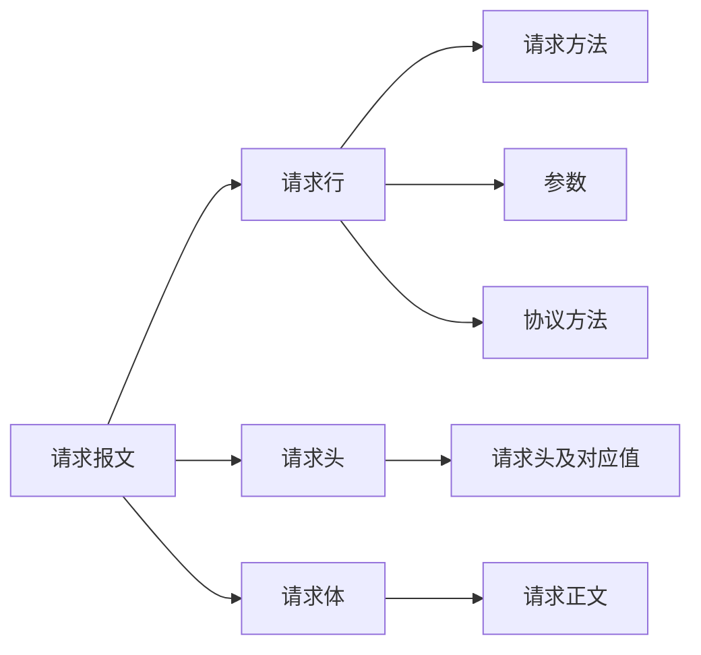
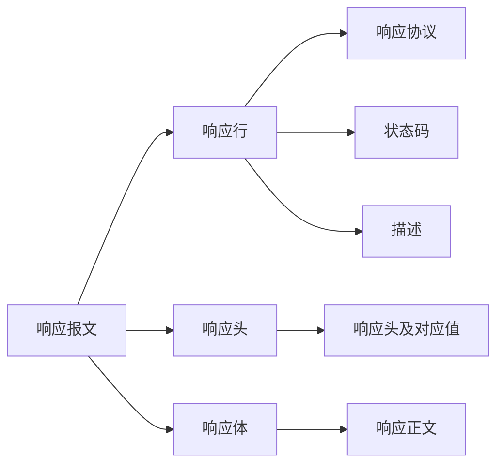

# HTTP

请求（request）、响应（response）

请求报文：

- 请求行
- 请求头
- 请求体

响应报文：

- 响应行
- 响应头
- 响应体

## 行

### 请求方法

请求方法（所有方法全为大写）有多种，各个方法的解释如下：

GET   请求获取Request-URI所标识的资源

POST  在Request-URI所标识的资源后附加新的数据

HEAD  请求获取由Request-URI所标识的资源的响应消息报头

PUT   请求服务器存储一个资源，并用Request-URI作为其标识

DELETE 请求服务器删除Request-URI所标识的资源

TRACE  请求服务器回送收到的请求信息，主要用于测试或诊断

CONNECT 保留将来使用

OPTIONS 请求查询服务器的性能，或者查询与资源相关的选项和需求

## 头

### 请求头

Accept 浏览器通过这个头，告诉服务器它所支持的数据类型

Accept-Charset 浏览器通过这个头，告诉服务器它采用的字符集

Accept-Encoding 浏览器通过这个头，告诉服务器，它所支持的压缩格式

Accept-Language 浏览器通过这个头，告诉服务器，它所采用的语言

Host 浏览器通过这个头，告诉服务器，我想访问服务器哪台主机

If-Modified-Since 浏览器通过这个头，告诉服务器，它缓存数据时间是多少。

Referer 浏览器通过这个头，告诉服务器，我是从哪个网页点过来的（防盗链）

User-Agent 浏览器通过这个头，告诉服务器，当前浏览器操作系统的信息，以及浏览器的版本号

Connection 通过这个头来标识此次请求使用的是长连接还是短连接

Date

### 响应头

Location 这个头通常配合302状态码使用，它用于告诉浏览器你去找谁。

Server 告诉浏览器，服务器的类型

Content-Encoding 服务器通过这个头，告诉浏览器，回送的数据采用的压缩格式。

Content-Length: 80

Content-Language: zh-cn

Content-Type 这个头用于告诉浏览器，回送数据的类型

Last-Modified 这个头用于告诉浏览器，数据的最后修改时间

Refresh 这个头用于控制浏览器定时刷新

Content-Disposition 用于通知浏览器，以下载方式打开回送的数据

Transfer-Encoding 用于通知浏览器，数据是以分块形式回送的

ETag 缓存相头的头

Expires 用于说明网页的失效时间，如果该值为一个<0的值，则服务器是通知浏览器不要缓存

Cache-Control: no-cache 通知浏览器不要缓存

Pragma: no-cache

 

数据类型：

text/html：HTML格式
text/plain ：纯文本格式
text/xml ： XML格式
image/gif ：gif图片格式
image/jpeg ：jpg图片格式
image/png：png图片格式
video/mpeg：视频
vedio/quicktime：视频
application/xhtml+xml ：XHTML格式
application/xml ： XML数据格式
application/atom+xml ：Atom XML聚合格式
application/json ： JSON数据格式
application/pdf ：pdf格式
application/msword ： Word文档格式
application/octet-stream ： 二进制流数据（如常见的文件下载）
application/x-www-form-urlencoded ：` < form encType=””>`中默认的encType，form表单数据被编码为key/value格式发送到服务器（表单默认的提交数据的格式）

## 状态码

- 1xx:服务器接受浏览器消息未完成
- 2xx:成功，200
- 3xx:重定向，302,304（访问缓存）
- 4xx:客户端错误，401（未经过验证），404（没有找到访问资源），403（无权限访问），405（请求方法不允许）
- 5xx:服务器错误，500（服务器内部异常）

---

GET通过/?变量=value	传入数据

POST在请求体中直接赋值传入数据